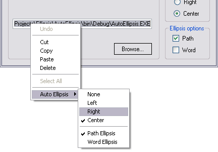

# Auto Ellipsis

Archive of **“Auto Ellipsis”**, a CodeProject article by **Thomas Polaert**, originally published on **20 June 2009**.

> **Archive status** — The original CodeProject site is no longer serving this historical article. This repository preserves the article, an archived HTML snapshot, and a reconstructed Visual Studio project for historical reference.

## Provenance

- **Author:** Thomas Polaert
- **Original CodeProject article ID:** `37503`
- **Historical URL:** `http://www.codeproject.com/Articles/37503/Auto-Ellipsis`
- **Historical source ZIP:** `http://www.codeproject.com/KB/cs/AutoEllipsis/AutoEllipsis_src.zip`
- **Wayback snapshot used:** `https://web.archive.org/web/20150608184821/http://www.codeproject.com/Articles/37503/Auto-Ellipsis`
- **Original publication date:** 20 June 2009
- **Original license:** Code Project Open License (**CPOL**)

The original source ZIP has not been recovered. `src/AutoEllipsis/Ellipsis.cs` is reconstructed with high confidence from overlapping code fragments printed in the archived article. The demo controls and form are functional reconstructions based on the behavior described in the article and are explicitly marked as such in the source.

A later crawled representation of the CodeProject page reported **481,637 views** and **1,990 downloads**. Because the crawler did not expose the original raw cached HTML, `archive/Auto-Ellipsis-CodeProject-crawled-reconstruction.html` is a reconstructed archival HTML, not a byte-for-byte copy of that crawl.

## Repository layout

```text
src/AutoEllipsis/          reconstructed Visual Studio 2005 / .NET 2.0 project
archive/                   archived/reconstructed HTML copies of the article
PROVENANCE.json            machine-readable provenance
LICENSE-NOTE.md            CPOL provenance note
```

## Article

The text below is converted from the archived CodeProject HTML so that the article remains readable directly from GitHub. Formatting may differ slightly from the original page; the HTML snapshot in `archive/` is the primary preserved artifact.

---


- [Download source and demo - 19.54 KB](https://web.archive.org/web/20150608184821/http://www.codeproject.com/KB/cs/AutoEllipsis/AutoEllipsis_src.zip)

## Introduction

Why yet another ellipsis control, when the .NET Framework already provides several built-in options to achieve this task? `System.Windows.Forms.Label` control comes with an `AutoEllipsis` property. `System.Drawing.Graphics.DrawString` or `System.Windows.Forms.TextRenderer.DrawText` offer a reliable way to make text fit into predefined boundaries. Just have a look at `StringTrimming` or `TextFormatFlags` enumeration! Not to mention `PathCompactPath` API from *shlwapi.dll* or Static control styles `SS_ENDELLIPSIS` and `SS_PATHELLIPSIS`.

Unfortunately, the built-in auto ellipsis controls provide no flexibility at all for ellipsis alignment. The text is always trimmed off at the end the `string`. This might be an issue, such as in the following example:

```
C:\Documents and Settings\TPOL\My Documents\Visual Studio 2005\
                Projects\MyProject1\Program.cs
C:\Documents and Settings\TPOL\My Documents\Visual Studio 2005\
                Projects\MyProject2\Program.cs
```

The built-in auto ellipsis controls display paths as follows:

```
C:\Documents and Settings\TPOL\My Documents\Visual...\Program.cs
C:\Documents and Settings\TPOL\My Documents\Visual...\Program.cs
```

It would be helpful to keep the last part of the path as it is more significant in this case.

```
C:\...Documents\Visual Studio 2005\Projects\MyProject1\Program.cs
C:\...Documents\Visual Studio 2005\Projects\MyProject2\Program.cs
```

By the way, Visual Studio 2005 behaves like this in the "File/Recent Files" menu.

## Using the Code

This is why I came up with the `Ellipsis` class. It is a `static` class with a single method:

```
public static string Compact(string text, Control ctrl, EllipsisFormat options)
```

The `Compact` function trims off argument `text` to make it fit into `ctrl` boundaries. `EllipsisFormat` enumeration is defined as follows:

```
[Flags]
public enum EllipsisFormat
{
    // Text is not modified.
    None = 0,
    // Text is trimmed at the end of the string. An ellipsis (...)
    // is drawn in place of remaining text.
    End = 1,
    // Text is trimmed at the beginning of the string.
    // An ellipsis (...) is drawn in place of remaining text.
    Start = 2,
    // Text is trimmed in the middle of the string.
    // An ellipsis (...) is drawn in place of remaining text.
    Middle = 3,
    // Preserve as much as possible of the drive and filename information.
    // Must be combined with alignment information.
    Path = 4,
    // Text is trimmed at a word boundary.
    // Must be combined with alignment information.
    Word = 8
}
```

The `Ellipsis` class can be used to implement flexible auto ellipsis on various Windows Form controls. I provided two examples in the demo project, one for `Label` control, one for `TextBox` control.

The `TextBoxEllipsis` switches to "full text" mode when it gains focus so its content can be edited as usual. It switches back to "ellipsis" mode when it loses focus.



## Inside the code

### Find the Correct Size: The Bisection Method

A working ellipse algorithm should find the longest substring that can fit into the control boundaries. The brute force approach would test all substrings by removing characters one by one. The proposed solution uses the bisection method to minimize the number of iterations to get the closest match.

The algorithm uses the `TextRenderer.MeasureText` method to get the size, in pixels, of the specified text drawn on the specified control (using the control's font). The bisection method is implemented as follows (some code has been removed for clarity):

```csharp
public static readonly string EllipsisChars = "...";

public static string Compact(string text, Control ctrl, EllipsisFormat options)
{
    using (Graphics dc = ctrl.CreateGraphics())
    {
        Size s = TextRenderer.MeasureText(dc, text, ctrl.Font);

        if (s.Width <= ctrl.Width)
            return text;

        int len = 0;
        int seg = text.Length;
        string fit = "";

        while (seg > 1)
        {
            seg -= seg / 2;

            int left = len + seg;
            int right = text.Length;

            if (left > right)
                continue;

            if ((EllipsisFormat.Middle & options) == EllipsisFormat.Middle)
            {
                right -= left / 2;
                left -= left / 2;
            }
            else if ((EllipsisFormat.Start & options) != 0)
            {
                right -= left;
                left = 0;
            }

            string tst = text.Substring(0, left) +
                EllipsisChars + text.Substring(right);

            s = TextRenderer.MeasureText(dc, tst, ctrl.Font);

            if (s.Width <= ctrl.Width)
            {
                len += seg;
                fit = tst;
            }
        }

        if (len == 0)
            return EllipsisChars;

        return fit;
    }
}
```

### Trim at a Word Boundary using Regular Expressions

The .NET Framework allows to trim text at a word boundary. We implement it by adjusting the substring bounds with regular expressions:

- `"\w*\W*"` matches a word followed by whitespaces
- `"\W*\w*$"` matches whitespaces followed by a word at the end of the `string`

These matches are subtracted from the substring (according to ellipsis alignment) in order to round up text at a word boundary.

```csharp
private static Regex prevWord = new Regex(@"\W*\w*$");
private static Regex nextWord = new Regex(@"\w*\W*");
```

### Trim a Path String

The "path" mode is a feature where the specified text is handled as a file path. The algorithm preserves as much as possible of the drive and filename information:

1. *c:\directory1\dir...\filename.ext*
2. *c:\...\filename.ext*
3. *...\filename.ext* (this is the shortest possible path, filename and extension are not truncated).

The archived article includes the complete path-specific fragments used to reconstruct `Ellipsis.cs`; see the preserved HTML and reconstructed source in this repository.

## History

- June 20, 2009 - Original article

---

## License note

The original CodeProject publication states that the article and associated source were distributed under the **Code Project Open License (CPOL)**. This repository is an archival reconstruction. Attribution to Thomas Polaert and the reconstruction status of non-recovered files are intentionally preserved.
